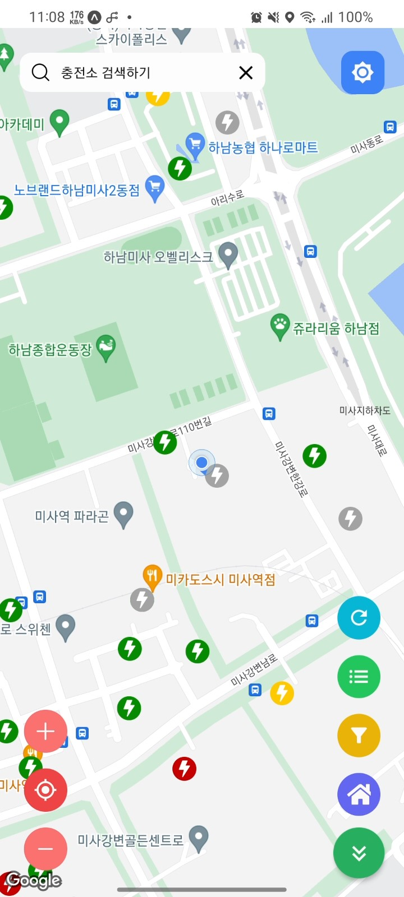

# 🔋 나만의 플러그 : myPlug

[]()
[]()

### 전기차 충전소 조회 및 추천 애플리케이션

    Android / iOS



## 👤 Authors
- [@gabrielyoon7 (윤주현, Gabriel Ju Hyun Yoon)](https://github.com/gabrielyoon7)
- [@gykim0923 (김가영)](https://github.com/gykim0923)
- [@SeonaePark (박선애)](https://github.com/SeonaePark)
- [@soyoung125 (박소영)](https://github.com/soyoung125)
- [@yeonsu00 (김연수)](https://github.com/yeonsu00)


## ⚙️ Tech

**Client ( Android/iOS Application )** 


[](https://reactnative.dev/)
[](https://ko.redux.js.org/introduction/getting-started/)
[](https://nativebase.io/)
[](https://reactnavigation.org/)
[](https://expo.dev/client)

**Server ( Node.js Application )**

[](https://nodejs.org/ko/)
[](https://reactnative.dev/)
[](https://www.mongodb.com/ko-kr)
[](https://mongoosejs.com/)

**Data Manager V2 ( Node.js Application )**

[](https://nodejs.org/ko/)
[](https://www.mongodb.com/ko-kr)
[](https://www.data.go.kr/data/15013115/standard.do)


***~~Data Manager V1 ( Java Application / Deprecated!!!)~~***

[](https://www.java.com/ko/)
[](https://www.mongodb.com/ko-kr)
[](https://www.data.go.kr/data/15013115/standard.do)


## 📂 Project Structure

프로젝트 구조는 다음과 같습니다.

    .
    ├── app-expo [Client (Android/iOS Application)]
    │   └── src
    │       ├── app
    │       │   ├── api
    │       │   ├── hooks
    │       │   └── redux
    │       ├── components
    │       └── containers
    ├── server [Server (Node.js Application)]
    │   ├── models
    │   └── routes
    └── data-manager [Data Manager V2 ( Node.js Application )]
        ├── legacy(stations-data-generator) [deprecated]
        └── src
            ├── api
            ├── controller
            └── models

- app-expo

React Native를 사용하여 작성한 충전소 지도 앱 입니다. 스마트폰에 Expo를 설치한 후 구동할 수 있습니다. (iOS/Android)

- server

충전소 지도 앱에서 사용할 DB 작업을 처리해줄 Node.js + Express 기반의 서버 입니다.

- data-manager

[한국환경공단(KECO)에서 제공하는 충전소API](https://www.data.go.kr/data/15013115/standard.do)를 사용하여 데이터를 수신 및 가공해주는 Node.js 애플리케이션입니다.

~~- stations-data-generator~~

~~[한국환경공단(KECO)에서 제공하는 충전소API](https://www.data.go.kr/data/15013115/standard.do)를 사용하여 데이터를 수신 및 가공해주는 Java 애플리케이션입니다.~~


## ✅ Features

    . [Client (Android/iOS Expo Application)]
    ├── 충전소 조회 (지도)
    │   ├── 충전소 실시간 검색
    │   ├── 지도 확대/축소/현위치
    │   │   └── 마커 클러스터링 적용
    │   ├── 충전소 리스트
    │   │   ├── 충전소 상태별 색상 표시
    │   │   └── 거리순 정렬
    │   ├── 충전소 조회
    │   │   ├── 충전소 간단 정보
    │   │   │    ├── 충전기 실시간 사용 정보
    │   │   │    └── 충전소 정보 간략히 제공
    │   │   └── 충전소 상세 정보
    │   │        ├── 충전소 정보 상세히 제공
    │   │        ├── 충전기 실시간 사용 정보
    │   │        ├── 충전기 사용 통계
    │   │        ├── 충전소 사용 통계
    │   │        ├── 즐겨찾기 등록
    │   │        └── 가까운 충전소 즉시 조회 및 이동
    │   ├── 충전소 필터링
    │   │   ├── 주차비 여부
    │   │   ├── 충전기 종류(DC차데모 / DC콤보 / AC완속 / AC3상)
    │   │   ├── 충전기 용량
    │   │   ├── 충전 방식
    │   │   ├── 충전기 상태
    │   │   ├── 이용자 제한
    │   │   └── 운영기관 필터링
    │   ├── 충전소 새로 고침
    │   └── 지도 테마 설정 (주간/야간 자동화)
    ├── 계정
    │   ├── 회원가입
    │   └── 로그인/로그아웃
    ├── 충전소 전국단위 검색
    │   ├── 충전소 지역/분류 선택 기능
    │   └── 검색 결과 리스트 출력 기능
    ├── 충전 일정 관리
    │   ├── (제작중)
    │   └── (제작중)
    └── 나의 자동차 설정
        ├── (제작중)
        └── (제작중)

    . [Server (Node.js Application)]
    └── App 사용에 필요한 RESTful API 형태로 구현

    . [Data Manager V2 ( Node.js Application )]
    ├── KECO로 부터 충전기 데이터 실시간 수신
    ├── KECO로 부터 수신 받은 데이터를 충전소와 충전기로 분리
    ├── 충전소와 충전기 데이터를 새 데이터로 overwrite (벌크형태로 저장/관리하여 속도 개선)
    ├── 충전기 사용 여부를 통계 데이터에 업데이트
    ├── 오래된 충전기 사용 통계는 자동 삭제
    └── 이 모든 과정을 주기적으로 자동 반복 처리

## 🧩 Demo and Screenshots


## ✨ Environment Variables

이 프로젝트 중 앱을 구동하기 위해서는 config.js 파일을 수정해줘야 합니다.
현재 PC의 내부 ip를 적습니다. (반드시 앱 구동 전에 실시되어야 합니다.)

```
export const config = {
	ip : 'http://192.168.0.11',    //이 부분을 수정
    ...
};
```

단, 로컬 환경에서 동작하지 않을 목적이라면 수정하실 필요가 없습니다.


## ✨ Run Locally

클론

```bash
  git clone https://github.com/KGU-DCS-LAB/myPlug
```

## ✨ Installation

이 프로젝트를 설치하기 위해...

### 설치 경로

프로젝트는 반드시 C드라이브에 clone합니다.

    C://myPlug


### `npm install`

> **Note: 패키지 변화가 없으면 매번 작업을 할 필요가 없습니다.**

package.json에 있는 npm 설치 이력을 토대로 본인 컴퓨터에 패키지를 자동으로 설치합니다.
이 작업은 평소에 할 필요가 없지만, 누군가가 새 패키지를 설치하는 경우 다른사람들이 모두 해줘야 합니다.

    부가 옵션으로 과거 버전의 패키지를 설치하는 방법이 있습니다.
    npm install --legacy-peer-deps
    패키지 설치 시 더이상 과거 버전을 지원하지 않는다거나 권장하지 않는다고 설치를 거부하는 경우 레거시 버전을 설치하는 방법입니다.

    만약 위 명령어로도 설치가 불가능하면
    npm install --force
    강제로 설치하는 명령어도 있습니다.

각각의 폴더에서 npm 설치 작업을 진행하여야 합니다.
## ✨ Deployment

이 프로젝트를 실행하기 위해...

### `npm start`
> **Note: 아래 `install 명령어`를 먼저 실행할 필요가 있을 수도 있습니다.**

이 프로그램을 실행하게 합니다.
실행에 성공하면 Expo가 자동으로 실행됩니다.

Expo는 Android나 iOS에 설치 후 스마트폰에서 직접 실행이 가능합니다.

이 프로젝트를 수정하고 저장하면 자동으로 리로딩이 됩니다.
오류가 발생하면 터미널 콘솔창에 찍힙니다. (터미널에 찍히지 않는 경우에는 웹 브라우저에서 확인)

    부가 옵션으로 cache를 초기화 하면서 실행하는 방법이 있습니다.
    npm start --reset-cache
    분명 코드가 잘 들어갔고, 아무리 생각해도 문제가 없음에도 불구하고 오류가 발생하면 위 명령어로 실행하는 방법이 있습니다.


## 🔎 References

- [React Native](https://reactnative.dev/)
- [Redux](https://ko.redux.js.org/introduction/getting-started/)
- [EXPO](https://expo.dev/)
- [React Native Navigation](https://reactnavigation.org/)
- [Native Base](https://nativebase.io/)
- [React Native Maps](https://github.com/react-native-maps/react-native-maps)
- [React](https://reactjs.org/)
- [Node.js](https://nodejs.org/en/)
- [Express.js](https://expressjs.com/)
- [Mongo DB](https://www.mongodb.com/)
- [mongoose](https://mongoosejs.com/)
- [한국환경공단(KECO)에서 제공하는 충전소API](https://www.data.go.kr/data/15013115/standard.do)


## 📄 Documentation

- [한국정보기술학회 2022 추계종합학술대회 및 일반.대학생논문경진대회](https://ki-it.or.kr/%EA%B3%B5%EC%A7%80%EC%82%AC%ED%95%AD/11591766)

    - 🏅은상 [실시간 전기자동차 충전소 사용 로그 수집 시스템](docs/pdf/%EC%8B%A4%EC%8B%9C%EA%B0%84%20%EC%A0%84%EA%B8%B0%EC%9E%90%EB%8F%99%EC%B0%A8%20%EC%B6%A9%EC%A0%84%EC%86%8C%20%EC%82%AC%EC%9A%A9%20%EB%A1%9C%EA%B7%B8%20%EC%88%98%EC%A7%91%20%EC%8B%9C%EC%8A%A4%ED%85%9C.pdf) 


    - 🏅동상 [전기자동차 충전소 사용 통계 정보의 사용자 친화적 질의가 가능한 다능한 앱](docs/pdf/%EC%A0%84%EA%B8%B0%EC%9E%90%EB%8F%99%EC%B0%A8%20%EC%B6%A9%EC%A0%84%EC%86%8C%20%EC%82%AC%EC%9A%A9%20%ED%86%B5%EA%B3%84%20%EC%A0%95%EB%B3%B4%EC%9D%98%20%EC%82%AC%EC%9A%A9%EC%9E%90%20%EC%B9%9C%ED%99%94%EC%A0%81%20%EC%A7%88%EC%9D%98%EA%B0%80%20%EA%B0%80%EB%8A%A5%ED%95%9C%20%EB%8B%A4%EB%8A%A5%ED%95%9C%20%EC%95%B1.pdf)

## 🔒 License

- TBD

## 🔥 Support

For support, email gabrielyoon7@gmail.com.

